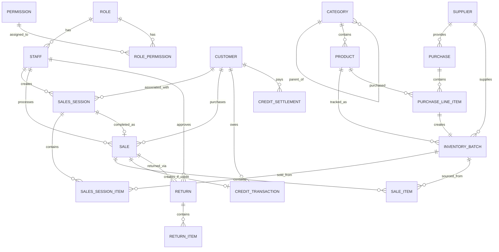

# Data Model: Hardware Store POS and Inventory System

**Feature**: 001-initial-pos-system
**Date**: 2025-10-09
**Database**: SQLite with GORM ORM

## Entity-Relationship Diagram



## Entity Definitions

### 1. Role

Represents a job function with associated permissions.

**Fields:**

| Field | Type | Constraints | Description |
|-------|------|-------------|-------------|
| id | uint | PK, Auto-increment | Unique identifier |
| name | string(50) | NOT NULL, UNIQUE | Role name (e.g., "Manager", "Cashier") |
| description | text | NULL | Optional description |
| is_active | bool | DEFAULT true | Soft delete flag |
| created_at | timestamp | Auto | Record creation time |
| updated_at | timestamp | Auto | Last modification time |

**Relationships:**
- One-to-many with Staff
- Many-to-many with Permission (via RolePermission)

**Indexes:**
- `idx_role_name` on (name)
- `idx_role_active` on (is_active)

**Validation Rules:**
- Name required, 2-50 characters
- Name must be unique (case-insensitive)

---

### 2. Permission

Represents a single granular operation in the system.

**Fields:**

| Field | Type | Constraints | Description |
|-------|------|-------------|-------------|
| id | uint | PK, Auto-increment | Unique identifier |
| name | string(100) | NOT NULL, UNIQUE | Permission name (e.g., "create_product") |
| resource | string(50) | NOT NULL | Resource type (products, sales, etc.) |
| action | string(20) | NOT NULL | Action (create, read, update, delete) |
| description | text | NULL | Human-readable description |
| created_at | timestamp | Auto | Record creation time |

**Relationships:**
- Many-to-many with Role (via RolePermission)

**Indexes:**
- `idx_permission_name` on (name)
- `idx_permission_resource_action` on (resource, action)

**Validation Rules:**
- Name format: `action_resource` (e.g., create_product)
- Resource and action required

**Predefined Permissions** (created during migration):
```
create_role, update_role, delete_role, view_roles
create_staff, update_staff, deactivate_staff, view_staff
create_customer, update_customer, view_customers
create_supplier, update_supplier, view_suppliers
create_category, update_category, delete_category, view_categories
create_product, update_product, delete_product, view_products
adjust_inventory, view_inventory
create_purchase, view_purchases
create_sales_session, manage_sales_sessions
process_payment, view_sales
manage_credits, settle_credits
process_return, approve_old_return
generate_receipt
```

---

### 3. RolePermission

Junction table for many-to-many relationship between Role and Permission.

**Fields:**

| Field | Type | Constraints | Description |
|-------|------|-------------|-------------|
| role_id | uint | FK, PK | Reference to Role |
| permission_id | uint | FK, PK | Reference to Permission |
| created_at | timestamp | Auto | When permission was granted |

**Relationships:**
- Belongs to Role
- Belongs to Permission

**Indexes:**
- Composite primary key on (role_id, permission_id)
- `idx_role_permissions` on (role_id)

**Foreign Keys:**
- role_id REFERENCES roles(id) ON DELETE CASCADE
- permission_id REFERENCES permissions(id) ON DELETE CASCADE

---

### 4. Staff

Represents an employee who uses the system.

**Fields:**

| Field | Type | Constraints | Description |
|-------|------|-------------|-------------|
| id | uint | PK, Auto-increment | Unique identifier |
| username | string(50) | NOT NULL, UNIQUE | Login username |
| password_hash | string(255) | NOT NULL | Bcrypt hashed password |
| first_name | string(50) | NOT NULL | First name |
| last_name | string(50) | NOT NULL | Last name |
| email | string(100) | NULL, UNIQUE | Email address (optional) |
| role_id | uint | FK, NOT NULL | Reference to Role |
| is_active | bool | DEFAULT true | Account status |
| last_login | timestamp | NULL | Last successful login |
| created_at | timestamp | Auto | Account creation time |
| updated_at | timestamp | Auto | Last modification time |

**Relationships:**
- Belongs to Role
- One-to-many with SalesSession
- One-to-many with Sale
- One-to-many with Return (as approver)

**Indexes:**
- `idx_staff_username` on (username)
- `idx_staff_role` on (role_id)
- `idx_staff_active` on (is_active)

**Validation Rules:**
- Username: 3-50 characters, alphanumeric + underscore
- Password: Minimum 8 characters (enforced at service layer)
- Email: Valid email format if provided
- Cannot delete staff with active transactions

---

### 5. Customer

Represents a person who purchases from the store.

**Fields:**

| Field | Type | Constraints | Description |
|-------|------|-------------|-------------|
| id | uint | PK, Auto-increment | Unique identifier |
| name | string(100) | NOT NULL | Customer name (required) |
| phone | string(20) | NULL | Phone number (optional) |
| email | string(100) | NULL | Email address (optional) |
| address | text | NULL | Physical address (optional) |
| credit_limit | decimal(10,2) | NULL | Warning threshold for credit |
| total_credit_balance | decimal(10,2) | DEFAULT 0 | Calculated field (updated via trigger/service) |
| created_at | timestamp | Auto | Record creation time |
| updated_at | timestamp | Auto | Last modification time |

**Relationships:**
- One-to-many with SalesSession
- One-to-many with Sale
- One-to-many with CreditTransaction
- One-to-many with CreditSettlement

**Indexes:**
- `idx_customer_name` on (name)
- `idx_customer_phone` on (phone)
- `idx_customer_credit_balance` on (total_credit_balance)

**Validation Rules:**
- Name required, minimum 2 characters
- Phone format: digits, spaces, hyphens only
- Email: Valid email format if provided
- Credit limit: Positive number or NULL

---

### 6. Supplier

Represents a vendor who provides inventory.

**Fields:**

| Field | Type | Constraints | Description |
|-------|------|-------------|-------------|
| id | uint | PK, Auto-increment | Unique identifier |
| name | string(100) | NOT NULL | Supplier name (required) |
| contact_person | string(100) | NULL | Contact person name |
| phone | string(20) | NULL | Phone number |
| email | string(100) | NULL | Email address |
| address | text | NULL | Physical address |
| created_at | timestamp | Auto | Record creation time |
| updated_at | timestamp | Auto | Last modification time |

**Relationships:**
- One-to-many with Purchase
- One-to-many with InventoryBatch

**Indexes:**
- `idx_supplier_name` on (name)

**Validation Rules:**
- Name required, minimum 2 characters
- Cannot delete supplier with existing purchases or inventory

---

### 7. Category

Represents a hierarchical product classification.

**Fields:**

| Field | Type | Constraints | Description |
|-------|------|-------------|-------------|
| id | uint | PK, Auto-increment | Unique identifier |
| name | string(100) | NOT NULL | Category name |
| parent_id | uint | FK, NULL | Reference to parent Category |
| level | int | DEFAULT 0 | Hierarchy level (0 = root) |
| path | string(255) | NULL | Materialized path (e.g., "/1/5/12") |
| created_at | timestamp | Auto | Record creation time |
| updated_at | timestamp | Auto | Last modification time |

**Relationships:**
- Self-referential: One-to-many (parent to children)
- One-to-many with Product

**Indexes:**
- `idx_category_parent` on (parent_id)
- `idx_category_path` on (path)
- `idx_category_name` on (name)

**Validation Rules:**
- Name required, minimum 2 characters
- Cannot delete category with products assigned
- Cannot set parent that would create circular reference
- Level automatically calculated from parent
- Path automatically updated on parent change

**Materialized Path Pattern:**
Enables efficient tree queries:
- Root category: path = "/1"
- Child of 1: path = "/1/5"
- Grandchild: path = "/1/5/12"

Query all descendants: `WHERE path LIKE '/1/%'`

---

### 8. Product

Represents an item sold in the store.

**Fields:**

| Field | Type | Constraints | Description |
|-------|------|-------------|-------------|
| id | uint | PK, Auto-increment | Unique identifier |
| code | string(50) | NOT NULL, UNIQUE | Product code (SKU) |
| description | string(255) | NOT NULL | Product description |
| category_id | uint | FK, NOT NULL | Reference to Category |
| attributes | json | NULL | Custom attributes (size, color, etc.) |
| is_active | bool | DEFAULT true | Product status |
| created_at | timestamp | Auto | Record creation time |
| updated_at | timestamp | Auto | Last modification time |

**Relationships:**
- Belongs to Category
- One-to-many with InventoryBatch
- One-to-many with PurchaseLineItem

**Indexes:**
- `idx_product_code` on (code)
- `idx_product_description` on (description)
- `idx_product_category` on (category_id)
- `idx_product_active` on (is_active)

**Validation Rules:**
- Code required, unique, 2-50 characters
- Description required, minimum 5 characters
- Category must exist
- Cannot delete product with existing inventory
- Attributes JSON schema:
  ```json
  {
    "size": "string",
    "color": "string",
    "material": "string",
    "weight": "number",
    // ... any custom fields
  }
  ```

---

### 9. Purchase

Represents a procurement transaction from a supplier.

**Fields:**

| Field | Type | Constraints | Description |
|-------|------|-------------|-------------|
| id | uint | PK, Auto-increment | Unique identifier |
| purchase_no | string(50) | NOT NULL, UNIQUE | Purchase order number |
| supplier_id | uint | FK, NOT NULL | Reference to Supplier |
| purchase_date | date | NOT NULL | Date of purchase |
| total_cost | decimal(12,2) | NOT NULL | Total purchase cost |
| notes | text | NULL | Additional notes |
| created_at | timestamp | Auto | Record creation time |
| updated_at | timestamp | Auto | Last modification time |

**Relationships:**
- Belongs to Supplier
- One-to-many with PurchaseLineItem

**Indexes:**
- `idx_purchase_no` on (purchase_no)
- `idx_purchase_supplier` on (supplier_id)
- `idx_purchase_date` on (purchase_date)

**Validation Rules:**
- Purchase number required, unique
- Supplier must exist
- Purchase date cannot be future date
- Total cost must match sum of line items (validated at service layer)

---

### 10. PurchaseLineItem

Represents individual products in a purchase order.

**Fields:**

| Field | Type | Constraints | Description |
|-------|------|-------------|-------------|
| id | uint | PK, Auto-increment | Unique identifier |
| purchase_id | uint | FK, NOT NULL | Reference to Purchase |
| product_id | uint | FK, NOT NULL | Reference to Product |
| quantity | int | NOT NULL | Quantity purchased |
| unit_cost_price | decimal(10,2) | NOT NULL | Cost per unit |
| unit_sale_price | decimal(10,2) | NOT NULL | Sale price per unit |
| line_total | decimal(12,2) | NOT NULL | quantity * unit_cost_price |
| created_at | timestamp | Auto | Record creation time |

**Relationships:**
- Belongs to Purchase
- Belongs to Product
- One-to-one with InventoryBatch (created automatically)

**Indexes:**
- `idx_purchase_line_purchase` on (purchase_id)
- `idx_purchase_line_product` on (product_id)

**Validation Rules:**
- Quantity must be positive integer
- Unit cost and sale prices must be positive
- Line total = quantity * unit_cost_price (calculated)
- Creates corresponding InventoryBatch automatically

**Foreign Keys:**
- purchase_id REFERENCES purchases(id) ON DELETE CASCADE
- product_id REFERENCES products(id) ON DELETE RESTRICT

---

### 11. InventoryBatch

Represents actual stock from a specific purchase.

**Fields:**

| Field | Type | Constraints | Description |
|-------|------|-------------|-------------|
| id | uint | PK, Auto-increment | Unique identifier |
| purchase_line_item_id | uint | FK, UNIQUE, NOT NULL | Reference to PurchaseLineItem |
| product_id | uint | FK, NOT NULL | Reference to Product |
| supplier_id | uint | FK, NOT NULL | Reference to Supplier |
| quantity | int | NOT NULL | Current available quantity |
| original_quantity | int | NOT NULL | Initial quantity (for tracking) |
| unit_cost_price | decimal(10,2) | NOT NULL | Cost per unit |
| unit_sale_price | decimal(10,2) | NOT NULL | Sale price per unit |
| received_date | date | NOT NULL | Date received (for FIFO) |
| created_at | timestamp | Auto | Batch creation time |
| updated_at | timestamp | Auto | Last modification time |

**Relationships:**
- Belongs to PurchaseLineItem (one-to-one)
- Belongs to Product
- Belongs to Supplier
- One-to-many with SalesSessionItem
- One-to-many with SaleItem

**Indexes:**
- `idx_inventory_purchase_line` on (purchase_line_item_id)
- `idx_inventory_product_available` on (product_id, quantity, received_date) - FIFO queries
- `idx_inventory_supplier_product` on (supplier_id, product_id)

**Validation Rules:**
- Quantity cannot be negative
- Quantity <= original_quantity
- Cannot delete batch with references in sales
- FIFO ordering: ORDER BY received_date ASC when selecting batches

**Foreign Keys:**
- purchase_line_item_id REFERENCES purchase_line_items(id) ON DELETE RESTRICT
- product_id REFERENCES products(id) ON DELETE RESTRICT
- supplier_id REFERENCES suppliers(id) ON DELETE RESTRICT

---

### 12. SalesSession

Represents an active or held POS transaction.

**Fields:**

| Field | Type | Constraints | Description |
|-------|------|-------------|-------------|
| id | uint | PK, Auto-increment | Unique identifier |
| session_id | string(36) | NOT NULL, UNIQUE | UUID for session |
| staff_id | uint | FK, NOT NULL | Cashier who created session |
| customer_id | uint | FK, NULL | Associated customer (optional) |
| bill_discount_type | string(10) | NULL | "percent" or "fixed" |
| bill_discount_value | decimal(10,2) | DEFAULT 0 | Discount value |
| status | string(20) | DEFAULT 'active' | active, completed, abandoned |
| last_activity | timestamp | NOT NULL | Last interaction time |
| created_at | timestamp | Auto | Session creation time |
| updated_at | timestamp | Auto | Last modification time |

**Relationships:**
- Belongs to Staff
- Belongs to Customer (optional)
- One-to-many with SalesSessionItem
- One-to-one with Sale (when completed)

**Indexes:**
- `idx_session_id` on (session_id)
- `idx_session_staff` on (staff_id)
- `idx_session_status` on (status)
- `idx_session_last_activity` on (last_activity)

**Validation Rules:**
- Session ID must be valid UUID
- Staff must exist and be active
- Status: enum('active', 'completed', 'abandoned')
- Bill discount value must be >= 0
- Last activity updated on every modification

**State Transitions:**
- active → completed (on payment)
- active → abandoned (cleanup job after 24 hours)
- Cannot modify completed or abandoned sessions

---

### 13. SalesSessionItem

Represents items in an active sales session cart.

**Fields:**

| Field | Type | Constraints | Description |
|-------|------|-------------|-------------|
| id | uint | PK, Auto-increment | Unique identifier |
| session_id | string(36) | FK, NOT NULL | Reference to SalesSession |
| inventory_batch_id | uint | FK, NOT NULL | Source batch |
| quantity | int | NOT NULL | Quantity selected |
| unit_price | decimal(10,2) | NOT NULL | Price per unit (from batch) |
| discount_type | string(10) | NULL | "percent" or "fixed" |
| discount_value | decimal(10,2) | DEFAULT 0 | Item-level discount |
| line_total | decimal(10,2) | NOT NULL | Calculated total |
| created_at | timestamp | Auto | Item added time |

**Relationships:**
- Belongs to SalesSession
- Belongs to InventoryBatch

**Indexes:**
- `idx_session_item_session` on (session_id)
- `idx_session_item_batch` on (inventory_batch_id)

**Validation Rules:**
- Quantity must be positive
- Quantity cannot exceed batch availability
- Line total = (quantity * unit_price) - discount (calculated)
- Discount value must be >= 0

**Foreign Keys:**
- session_id REFERENCES sales_sessions(session_id) ON DELETE CASCADE
- inventory_batch_id REFERENCES inventory_batches(id) ON DELETE RESTRICT

---

### 14. Sale

Represents a completed sale transaction.

**Fields:**

| Field | Type | Constraints | Description |
|-------|------|-------------|-------------|
| id | uint | PK, Auto-increment | Unique identifier |
| transaction_id | string(50) | NOT NULL, UNIQUE | Human-readable transaction ID |
| session_id | string(36) | FK, UNIQUE, NULL | Original session (if from POS) |
| staff_id | uint | FK, NOT NULL | Cashier who processed sale |
| customer_id | uint | FK, NULL | Customer (if associated) |
| subtotal | decimal(10,2) | NOT NULL | Sum of item totals |
| bill_discount | decimal(10,2) | DEFAULT 0 | Bill-level discount amount |
| tax_amount | decimal(10,2) | DEFAULT 0 | Tax amount |
| total | decimal(10,2) | NOT NULL | Final total |
| payment_method | string(20) | NOT NULL | cash, card, credit |
| amount_paid | decimal(10,2) | NULL | For cash payments |
| change_given | decimal(10,2) | NULL | For cash payments |
| sale_date | timestamp | NOT NULL | Transaction timestamp |
| created_at | timestamp | Auto | Record creation time |

**Relationships:**
- Belongs to Staff
- Belongs to Customer (optional)
- Belongs to SalesSession (optional)
- One-to-many with SaleItem
- One-to-one with CreditTransaction (if payment_method='credit')
- One-to-many with Return

**Indexes:**
- `idx_sale_transaction_id` on (transaction_id)
- `idx_sale_staff` on (staff_id)
- `idx_sale_customer` on (customer_id)
- `idx_sale_payment_method` on (payment_method)
- `idx_sale_date` on (sale_date)

**Validation Rules:**
- Transaction ID format: YYYY-MMDD-NNNNNN (e.g., 2025-1009-000123)
- Payment method: enum('cash', 'card', 'credit')
- Total = subtotal - bill_discount + tax_amount (calculated)
- If cash: amount_paid >= total, change_given = amount_paid - total
- If credit: customer_id required
- Immutable after creation (no updates allowed)

**Foreign Keys:**
- staff_id REFERENCES staff(id) ON DELETE RESTRICT
- customer_id REFERENCES customers(id) ON DELETE RESTRICT
- session_id REFERENCES sales_sessions(session_id) ON DELETE SET NULL

---

### 15. SaleItem

Represents individual items in a completed sale.

**Fields:**

| Field | Type | Constraints | Description |
|-------|------|-------------|-------------|
| id | uint | PK, Auto-increment | Unique identifier |
| sale_id | uint | FK, NOT NULL | Reference to Sale |
| inventory_batch_id | uint | FK, NOT NULL | Source batch (for returns) |
| product_code | string(50) | NOT NULL | Product code (snapshot) |
| product_description | string(255) | NOT NULL | Description (snapshot) |
| quantity | int | NOT NULL | Quantity sold |
| unit_price | decimal(10,2) | NOT NULL | Price per unit |
| discount_amount | decimal(10,2) | DEFAULT 0 | Item discount |
| line_total | decimal(10,2) | NOT NULL | Calculated total |
| created_at | timestamp | Auto | Record creation time |

**Relationships:**
- Belongs to Sale
- Belongs to InventoryBatch
- One-to-many with ReturnItem

**Indexes:**
- `idx_sale_item_sale` on (sale_id)
- `idx_sale_item_batch` on (inventory_batch_id)

**Validation Rules:**
- Quantity must be positive
- Line total = (quantity * unit_price) - discount_amount (calculated)
- Product snapshot fields for historical record (in case product deleted)
- Immutable after creation

**Foreign Keys:**
- sale_id REFERENCES sales(id) ON DELETE CASCADE
- inventory_batch_id REFERENCES inventory_batches(id) ON DELETE RESTRICT

---

### 16. CreditTransaction

Represents money owed by a customer from a credit sale.

**Fields:**

| Field | Type | Constraints | Description |
|-------|------|-------------|-------------|
| id | uint | PK, Auto-increment | Unique identifier |
| customer_id | uint | FK, NOT NULL | Reference to Customer |
| sale_id | uint | FK, UNIQUE, NOT NULL | Reference to Sale |
| amount | decimal(10,2) | NOT NULL | Credit amount |
| remaining_balance | decimal(10,2) | NOT NULL | Current outstanding balance |
| status | string(20) | DEFAULT 'outstanding' | outstanding, partially_paid, paid |
| created_at | timestamp | Auto | Credit creation time |
| updated_at | timestamp | Auto | Last modification time |

**Relationships:**
- Belongs to Customer
- Belongs to Sale (one-to-one)
- One-to-many with CreditSettlement

**Indexes:**
- `idx_credit_customer` on (customer_id)
- `idx_credit_sale` on (sale_id)
- `idx_credit_status` on (status)

**Validation Rules:**
- Amount must be positive
- Remaining balance <= amount
- Remaining balance >= 0
- Status: enum('outstanding', 'partially_paid', 'paid')
- Status updated automatically based on remaining_balance

**Foreign Keys:**
- customer_id REFERENCES customers(id) ON DELETE RESTRICT
- sale_id REFERENCES sales(id) ON DELETE RESTRICT

---

### 17. CreditSettlement

Represents a payment made to reduce credit balance.

**Fields:**

| Field | Type | Constraints | Description |
|-------|------|-------------|-------------|
| id | uint | PK, Auto-increment | Unique identifier |
| credit_transaction_id | uint | FK, NOT NULL | Reference to CreditTransaction |
| customer_id | uint | FK, NOT NULL | Reference to Customer |
| amount | decimal(10,2) | NOT NULL | Payment amount |
| payment_method | string(20) | NOT NULL | cash or card |
| payment_date | timestamp | NOT NULL | Payment timestamp |
| staff_id | uint | FK, NOT NULL | Staff who processed payment |
| notes | text | NULL | Additional notes |
| created_at | timestamp | Auto | Record creation time |

**Relationships:**
- Belongs to CreditTransaction
- Belongs to Customer
- Belongs to Staff

**Indexes:**
- `idx_settlement_credit` on (credit_transaction_id)
- `idx_settlement_customer` on (customer_id)
- `idx_settlement_date` on (payment_date)

**Validation Rules:**
- Amount must be positive
- Amount cannot exceed remaining balance of credit transaction
- Payment method: enum('cash', 'card')
- Updates CreditTransaction.remaining_balance on insert

**Foreign Keys:**
- credit_transaction_id REFERENCES credit_transactions(id) ON DELETE RESTRICT
- customer_id REFERENCES customers(id) ON DELETE RESTRICT
- staff_id REFERENCES staff(id) ON DELETE RESTRICT

---

### 18. Return

Represents a return transaction for previously sold items.

**Fields:**

| Field | Type | Constraints | Description |
|-------|------|-------------|-------------|
| id | uint | PK, Auto-increment | Unique identifier |
| return_no | string(50) | NOT NULL, UNIQUE | Return transaction number |
| sale_id | uint | FK, NOT NULL | Original sale |
| staff_id | uint | FK, NOT NULL | Staff who processed return |
| approved_by_staff_id | uint | FK, NULL | Manager who approved (if old) |
| refund_amount | decimal(10,2) | NOT NULL | Total refund amount |
| refund_method | string(20) | DEFAULT 'cash' | cash (or credit adjustment) |
| return_date | timestamp | NOT NULL | Return timestamp |
| notes | text | NULL | Return reason/notes |
| created_at | timestamp | Auto | Record creation time |

**Relationships:**
- Belongs to Sale
- Belongs to Staff (processor)
- Belongs to Staff (approver, optional)
- One-to-many with ReturnItem

**Indexes:**
- `idx_return_no` on (return_no)
- `idx_return_sale` on (sale_id)
- `idx_return_date` on (return_date)

**Validation Rules:**
- Return number format: RET-YYYY-MMDD-NNNNNN
- Sale must exist
- If sale > 7 days old: approved_by_staff_id required
- Refund amount = sum of return items
- Refund method: enum('cash', 'credit_adjustment')
- Restores inventory to original batches

**Foreign Keys:**
- sale_id REFERENCES sales(id) ON DELETE RESTRICT
- staff_id REFERENCES staff(id) ON DELETE RESTRICT
- approved_by_staff_id REFERENCES staff(id) ON DELETE SET NULL

---

### 19. ReturnItem

Represents individual items being returned.

**Fields:**

| Field | Type | Constraints | Description |
|-------|------|-------------|-------------|
| id | uint | PK, Auto-increment | Unique identifier |
| return_id | uint | FK, NOT NULL | Reference to Return |
| sale_item_id | uint | FK, NOT NULL | Original sale item |
| inventory_batch_id | uint | FK, NOT NULL | Batch to restore to |
| quantity | int | NOT NULL | Quantity returned |
| unit_refund | decimal(10,2) | NOT NULL | Refund per unit |
| line_refund | decimal(10,2) | NOT NULL | Total refund for item |
| created_at | timestamp | Auto | Record creation time |

**Relationships:**
- Belongs to Return
- Belongs to SaleItem
- Belongs to InventoryBatch

**Indexes:**
- `idx_return_item_return` on (return_id)
- `idx_return_item_sale_item` on (sale_item_id)

**Validation Rules:**
- Quantity must be positive
- Quantity cannot exceed original sale item quantity
- Unit refund matches original unit price (including discount)
- Line refund = quantity * unit_refund (calculated)
- Increases inventory_batch.quantity on insert

**Foreign Keys:**
- return_id REFERENCES returns(id) ON DELETE CASCADE
- sale_item_id REFERENCES sale_items(id) ON DELETE RESTRICT
- inventory_batch_id REFERENCES inventory_batches(id) ON DELETE RESTRICT

---

## Database Triggers and Calculated Fields

### Trigger 1: Update Customer Credit Balance

```sql
-- After INSERT on credit_transactions
CREATE TRIGGER update_customer_credit_on_insert
AFTER INSERT ON credit_transactions
BEGIN
    UPDATE customers
    SET total_credit_balance = total_credit_balance + NEW.amount
    WHERE id = NEW.customer_id;
END;

-- After INSERT on credit_settlements
CREATE TRIGGER update_customer_credit_on_settlement
AFTER INSERT ON credit_settlements
BEGIN
    UPDATE customers
    SET total_credit_balance = total_credit_balance - NEW.amount
    WHERE id = NEW.customer_id;

    UPDATE credit_transactions
    SET remaining_balance = remaining_balance - NEW.amount,
        status = CASE
            WHEN remaining_balance - NEW.amount = 0 THEN 'paid'
            WHEN remaining_balance - NEW.amount < amount THEN 'partially_paid'
            ELSE 'outstanding'
        END
    WHERE id = NEW.credit_transaction_id;
END;
```

### Trigger 2: Deduct Inventory on Sale

```sql
-- After INSERT on sale_items
CREATE TRIGGER deduct_inventory_on_sale
AFTER INSERT ON sale_items
BEGIN
    UPDATE inventory_batches
    SET quantity = quantity - NEW.quantity
    WHERE id = NEW.inventory_batch_id;
END;
```

### Trigger 3: Restore Inventory on Return

```sql
-- After INSERT on return_items
CREATE TRIGGER restore_inventory_on_return
AFTER INSERT ON return_items
BEGIN
    UPDATE inventory_batches
    SET quantity = quantity + NEW.quantity
    WHERE id = NEW.inventory_batch_id;
END;
```

### Trigger 4: Create Inventory Batch on Purchase Line Item

```sql
-- After INSERT on purchase_line_items
CREATE TRIGGER create_inventory_batch
AFTER INSERT ON purchase_line_items
BEGIN
    INSERT INTO inventory_batches (
        purchase_line_item_id,
        product_id,
        supplier_id,
        quantity,
        original_quantity,
        unit_cost_price,
        unit_sale_price,
        received_date
    )
    SELECT
        NEW.id,
        NEW.product_id,
        p.supplier_id,
        NEW.quantity,
        NEW.quantity,
        NEW.unit_cost_price,
        NEW.unit_sale_price,
        p.purchase_date
    FROM purchases p
    WHERE p.id = NEW.purchase_id;
END;
```

---

## Indexes Summary

**Critical Performance Indexes:**

1. **Product Search**: `idx_product_code`, `idx_product_description`
2. **Inventory FIFO**: `idx_inventory_product_available` (product_id, quantity, received_date)
3. **Session Management**: `idx_session_last_activity`, `idx_session_status`
4. **Sales Reporting**: `idx_sale_date`, `idx_sale_payment_method`
5. **Customer Credit**: `idx_credit_customer`, `idx_credit_status`

---

## Migration Order

1. roles
2. permissions
3. role_permissions
4. staff
5. customers
6. suppliers
7. categories
8. products
9. purchases
10. purchase_line_items
11. inventory_batches
12. sales_sessions
13. sales_session_items
14. sales
15. sale_items
16. credit_transactions
17. credit_settlements
18. returns
19. return_items

---

## Data Integrity Rules

1. **Cannot delete referenced records:**
   - Supplier with purchases or inventory
   - Product with inventory or sales
   - Category with products
   - Staff with sales

2. **Cascade deletes:**
   - Delete sale → delete sale_items
   - Delete return → delete return_items
   - Delete purchase → delete purchase_line_items
   - Delete sales_session → delete sales_session_items

3. **Soft deletes:**
   - Staff (is_active flag)
   - Role (is_active flag)
   - Product (is_active flag)

4. **Immutable records:**
   - Sale (no updates after creation)
   - SaleItem (no updates after creation)
   - Return (no updates after creation)
   - CreditTransaction amount (no updates, only remaining_balance)

---

This data model supports all functional requirements while maintaining referential integrity and enabling efficient queries for a 10,000+ product inventory system with multiple concurrent POS sessions.
